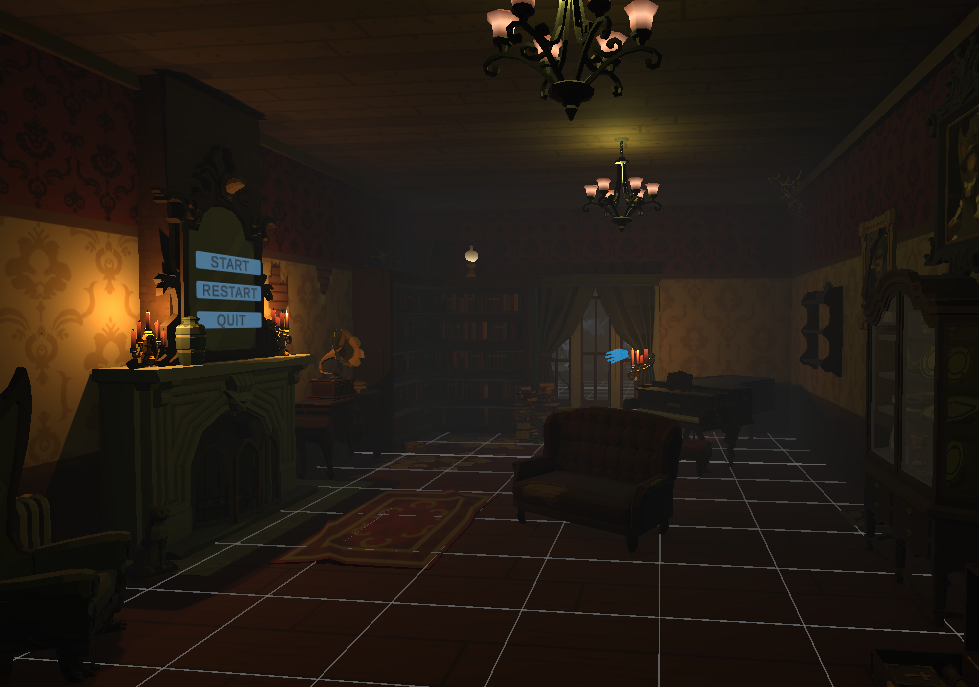
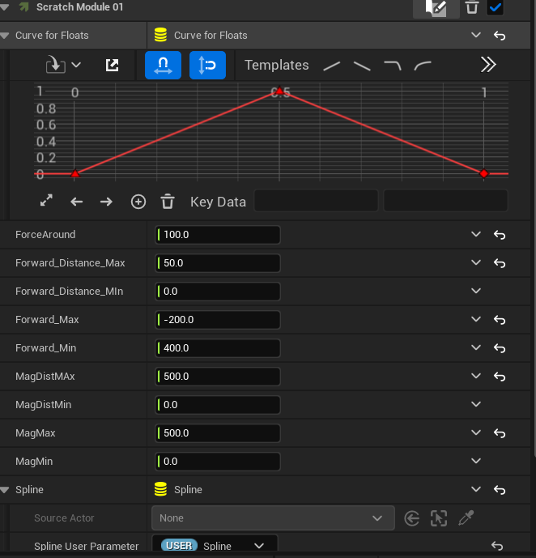
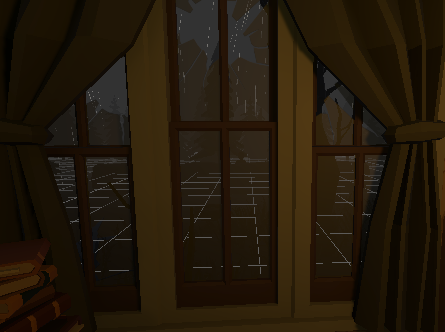

## Night In The Mansion

**Introduction**

Night In The Mansion was made for a 2023 Halloween Game Jam. In this game you are a ghost attempting to scare a teenager that has broken into your mansion. There are interactable objects in the scene that have sound and animation events which will scare the Non Player Character(NPC) if they are close enough when the event is triggered.

This game placed 5th out of 23 entries with the highest ratings coming from Aesthetic, Halloween mood, and sound.

 

**Development**

The development was done by myself and two others who were located in Germany and Austria. We would meet in discord calls during overlapped free time, but were mostly working independently and updated each other through the projects GitHub.

I was in charge of Level Design, Lighting, and Sound. I also worked on some C# code to tie the VR player interactions to Unity Animation Controllers on props and the Player. Below is a “Haunted Item” function where the item plays an animation when activated, a separate script is also pictured which shows the call to the teenagers animation controller as well as adding a point to the player’s total if the teenager is not already in the sacred state.

The level was made using Synthy assets from the Unity Asset Store. Game object segments were assembled to make a small room of the mansion along with an outdoor scene and a secret room.

The sounds were sourced from sound libraries and recorded by me. All sound in the game was spacialized so that players would hear different sounds depending on their location in the scene. For example the window of the room had a blend of the indoor rain sound and an outdoor rain sound.

[Video of window sound?]

The full development for this game was done in one week and was part of the Game Jam highlight video for one of the host’s YouTube Channel Link Below.
[link]

 **Learned**

Through this project I was able to learn more about coordinating with international team members. I had worked with both people before in a previous Game Jam, but I often am paired with strangers who live in different time zones. 

I used this jam to spend more time with lighting and sound design than I had in past games. This provided me with a great chance to experiment with ambient sounds and find prop sounds that worked well with game objects and each other. Most sounds needed to be trimmed or fixed to work in Unity which gave me time to learn more about Reaper Audio.

This project allowed me to become more familiar with the complex side of Unity’s animation controller. In the past I have used it to set up VR player hands, but I had never tried to string together NPC animations or timed Animation events.

