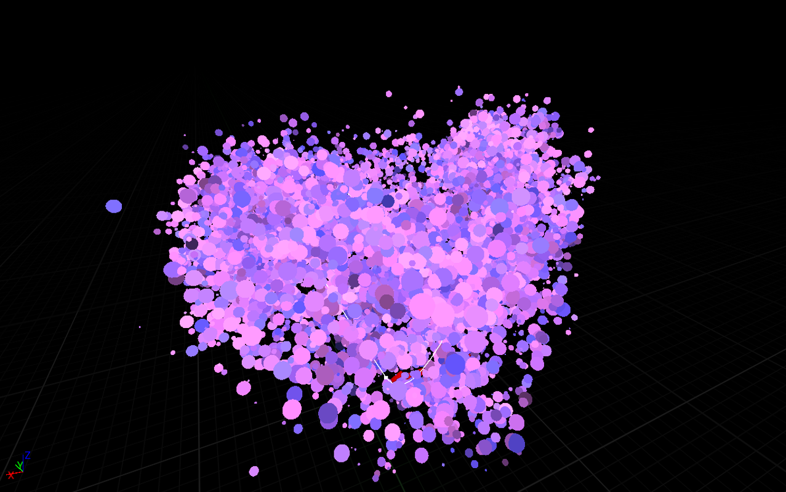

## Particles

**Introduction**

Particles is an interactive Virtual Reality experience where the guest is able to push around small orbs using their hands.

This project was displayed in the 2024 pop-up exhibition at Bird Block Gallery and Ceramics Studio “Bird Bonk”. It was made to be a simple interaction so that all ages and experience levels would be able to put on the headset and understand what to do.

 

**Development**

Particles uses a Niagara Particle that is bound to a spline path by several simulated physics forces. All the forces are adjustable and can affect the form the particle stream takes as each of the 15000 particles make their way around the spline.

Guests are able to push the particles out of the way using their hands which have point forces that are updated to the hand locations every frame.

**Display**

Particles was displayed in a small back room of Bird Block Gallery and Ceramics Studio in Blacksburg Virginia. It was viewed by more than 30 individuals during the exhibition who put on a Quest 3 Vr headset. This headset was connected to a computer which had a build of Particles purpertually running. The cable was able to keep the headset charged during the 4 hour exhibition and did not have any connection interuption.

 

 **Insparation**
 
This work was born out of my experimentation with Boids in both Unity and Unreal Engine 5. Boids, developed by Craig Renolds in 1987, are small objects that use a small set of rules to create flock-like behaviors. For me they were an introduction to emergent behaviors in games.

